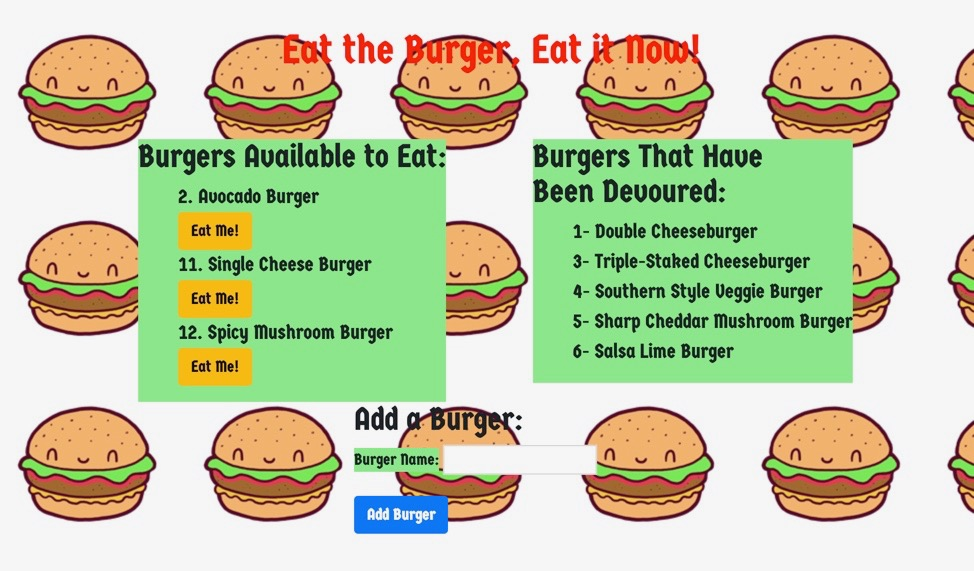

# burger_Eat-the-burger
Node Express Handlebars application. 

## Table of contents

* [About this project](#about-this-project)
* [Project requirements](#project-requirements)
* [Structure of the project](#structure-of-the-project)
* [Screenshots](#screenshots)
* [Video walk Through](#video)
* [Technologies used to create app](#technologies-used)
* [How to use app](#how-to-use)

##  About this project
This project I created a burger logger with MySQL, Node, Express, Handlebars and a homemade ORM. I used a MVC design pattern; use Node and MySQL to query and route data in your app, and Handlebars to generate your HTML.

##  Project requirements

<li>1. Eat-the-Burger is a restaurant app that lets users input the names of burgers they would like to eat. </li>

<li>2. Whenever the user submits a burger's name, your app will display the burger on the left side of the page, waiting to be devoured.</li>

<li>3. Each burger in the waiting area also has a 'Devour it!' button. When the user clicks it the burger will move to the right side of the page.</li>

<li>4. Your app will store every burger in a database, whether devoured or not.

   
##  Structure of the project
<li>README.md</li>
<li>gitignore</li>
<li>config</li>
    <li>* connection.js</li>
    <li>* orm.js</li>
<li>* controllers</li>
    <li>* burgers_controller.js</li>
<li>* db</li>
    <li>* schema.sql</li>
    <li>* seeds.js</li>
<li>models</li>  
    <li>* burger.js</li>
<li>node_modules</li>
<li>package.json</li>
<li>public</li>
    <li>assets</li>
        <li>css</li>
            <li>burger_style.css</li>
        <li>img</li>
            <li>burger.png</li>
<li>server.js</li>
<li>views</li>
    <li>index.handlebars</li>
    <li>layouts</li>
        <li>main.handlebars</li>
    

##  Screenshots
Images of Eat-the-Burger app

##  Technologies used to create the app
<li>node.js - https://nodejs.org/en/</li>
<li>heroku-cli NPM Package - https://www.npmjs.com/package/heroku-cli</li>
<li>body-parser NPM Package - https://www.npmjs.com/package/body-parser</li>
<li>express NPM Package - https://www.npmjs.com/package/express</li>
<li>path NPM Package - https://www.npmjs.com/package/path</li>

##  How to use app
<li>Navigate to the href="https://hidden-cove-50002.herokuapp.com".</li>
<li>Select "Eat me" to devour the burger.</li>
<li>The user can also 'Add Burger' to add another to the list.</li>

